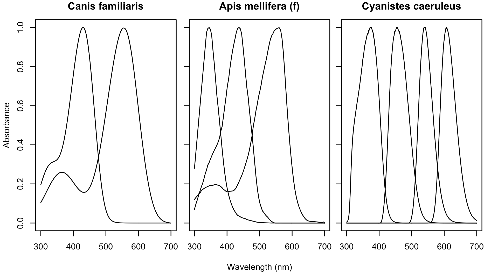

# `spectra.visual`

[](https://www.repostatus.org/#wip)
[](https://cran.r-project.org/package=spectra.visual/)
[](https://travis-ci.org/thomased/spectra.visual/)
[](https://codecov.io/github/thomased/spectra.visual?branch=master)
[](https://cran.r-project.org/package=spectra.visual/)

## Spectral sensitivity data package

`spectra.visual` is a a database of receptor absorbance and ocular
transmission spectra and metadata, useful for visual/colorspace
modelling among other things. It currently contains **283 spectra** from
**82 species**.



## Installation

To download the development version of `spectra.visual`, you can:

  - use the [`remotes`](https://github.com/r-lib/remotes) package:

<!-- end list -->

``` r
# install.packages("remotes")
remotes::install_github("thomased/spectra.visual")
```

  - download files from GitHub and install using `$R CMD INSTALL` or,
    from within R:

<!-- end list -->

``` r
install.packages(path, type = "source", repos = NULL)
```

## Browsing and searching spectra

The entire database can be loaded into memory by simply calling
`data(specvis_spectra)`, along with the metadata `data(specvis_meta)`
and dictionary `data(specvis_dict)`.

Alternately, the `specvis_search()` function allows you to query the
available data and return a select subset based on search terms
(e.g. `specvis_search(genus == 'bombus')`), with the option of
returning either raw spectra or metadata via the `return.spectra`
argument.

## Contributing

Contributions of spectra to the package are most welcome. There are a
few ways to do so, from most- to least-involved:

  - **via pull request**
      - Install the `spectra.visual` package in the usual manner.
      - Fork and clone the package repository.
      - Append your spectra to the `data-raw/specvis_spectra.csv` file,
        and complete all metadata fields in the
        `data-raw/specvis_meta.csv` file. Spectra should follow the
        naming convention `<species>_<genus>.<integer>`, where
        `<integer>` begins at 1 and proceeds from the shortest- to
        longest- wavelength sensitive receptor.
      - Run the function `specvis_rebuild()` to rebuild the database
        (i.e. to save the raw data as `.rda` files.
      - Commit and push your changes, and submit a pull request.
  - **via email, v1**
      - Take a look at the structure of the package’s spectral data
        (`data(specvis_spectra)`) and metadata (`data(specvis_meta)`).
      - [Email me](mailto:thomas.white@sydney.edu.au) your data in as
        similar a format as possible (but I’ll take anything).
  - **via email, v2**
      - [Email me](mailto:thomas.white@sydney.edu.au) a paper containing
        data that you’d like added (containing either lambda-max values
        or plotted absorbance curves, at a minimum).

## Citing

If you find the package useful, please cite the original data
source(s)and the `spectra.visual` package (see
`citation("spectra.visual")` for the reference).
